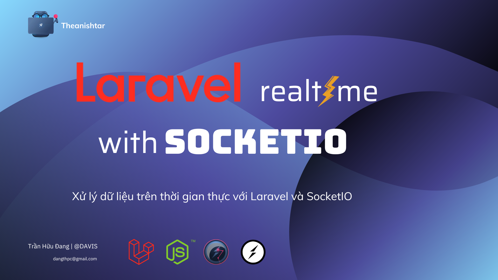

# Xử lý dữ liệu Realtime với Laravel và SocketIO (NodeJS)



## Cài đặt và chạy
```bash
composer install
npm install 

php artisan serve
node server 
```


## Yêu cầu dự án
từ client sẽ emit điểm & user_id lên sever, server khi listen đc sự kiện emit thì sẽ lưu lại điểm trên mysql, sau đó emit một sự kiện đến tất cả client dữ liệu bảng điểm toàn server

mình làm demo nhỏ, bao gồm 1 client sẽ gửi điểm, 1 server lưu & trả ra bảng điểm toàn server

## Mô tả dự án

Khi server nhận được một emit từ `port` 3000. Server sẽ gửi thông tin đến các client


### Cấu hình server Socket

```js
const server = require('http').createServer(app);
const io = require('socket.io')(server, {
  cors: { origin: "*" }
});
```

### Gửi dữ liệu qua APIs Laravel

```js

async function sendDataToLaravel(data, req) {
  try {
    console.log(data)
    const url = `http://127.0.0.1:8000/scope?name=${data.id}&scope=${data.scope}`;
    const response = await axios.post(url, data, {
      // Set các dữ liệu Request
    });
    console.log('Response from Laravel:', response.data);
    return response.data;
  } catch (error) {
    console.error('Error sending data to Laravel:', error.message);
    throw error;
  }
}
```

### Nhận dữ liệu

```js
let ip_address = '127.0.0.1';
let socket_port = '3000';
let socket = io(ip_address + ':' + socket_port);

socket.on('sendChatToClient', (message) => {
  $('.chat-content ul').append(`<li>${message}</li>`);
});
```
